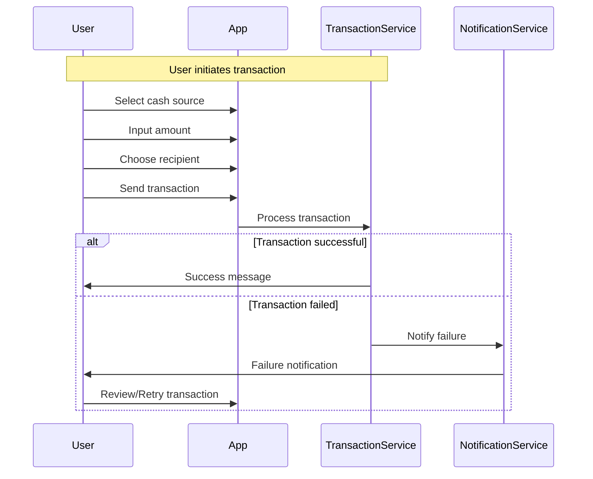
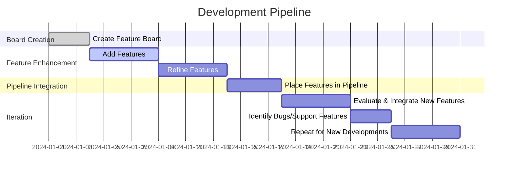

#### Internet Junkie
During a routine perusal of Twitter, I saw a post by Nikita Bier. Bier, was the founder of "tbh" (presumably an acronym for "to be honest") if I am not mistaken, which was later acquired by Facebook, and also founded the app "Gas," targeting high school students and a few months after its launch, acquired by Discord. I am not sure how much time Bier spent on orchestrating these apps, whether they were the products of excruciating planning or what came out of a bathroom session and some scrabbles on his iPhone, but, regardless, the execution was stellar. Within a few weeks both apps became viral and eventually got acquired for hefty lump-sums.

There are a few startup founders whom I greatly admire, coming from diverse backgrounds. Some are engineers, while others specialize in product. All of them share a commonality: they each possess a unique thesis that guides their approach to launching startups. They are noteworthy for their systematic frameworks and playbooks for developing startups - whether these strategies are formally documented or mentally conceptualized, I don't know. Generally, they exhibit consistent patterns in building new products, forming teams, designing company structures, and in their operational styles.

A couple of weeks ago, there was a video featuring Javier Milei, who is currently the President of Argentina. Milei is known for his staunchly neo-capitalist views. He identifies himself as an anarcho-capitalist and holds opinions deeply rooted in extreme capitalist ideologies. His belief system revolves around the notion that the state's role should be significantly reduced, advocating for the unfettered freedom of corporations. While I am not completely certain about the specifics of his political agenda or manifesto, [he recently spoke at the Economic Forum in Davos](https://www.weforum.org/agenda/2024/01/special-address-by-javier-milei-president-of-argentina/). In this talk, he discussed the perils of socialism and championed the free enterprise system as superior to all other socioeconomic models.

> Today I'm here to tell you that the Western world is in danger. And it is in danger because those who are supposed to have to defend the values of the West are co-opted by a vision of the world that inexorably leads to socialism and thereby to poverty.

> Far from being the cause of our problems, free trade capitalism as an economic system is the only instrument we have to end hunger, poverty and extreme poverty across our planet. The empirical evidence is unquestionable.

Now, there's a video of Javier Milei that I believe was released shortly before his election, possibly a few weeks prior. In the video, Milei stands in front of a board adorned with Post-it notes or magnetized notes, each labeled with the name of a ministry in the Argentine government. Milei, who I think is Argentine and speaks Spanish, approaches the board. Featured are ministries like the Ministry of Human Rights and the Ministry of Environment Protection, among others. These are relatively new ministries, established in response to emerging social issues. In a dramatic gesture, Milei removes one of the notes from the board and exclaims "Afuera!" which, in Spanish, means "out." Eliminating these ministries is he what he promises. He continues this action, removing five or six ministry notes in total.

<iframe width="560" height="315" src="https://www.youtube.com/embed/fJFqjiB0GW0?si=AYhOaitIiXowNmjp&amp;start=27" title="YouTube video player" frameborder="0" allow="accelerometer; autoplay; clipboard-write; encrypted-media; gyroscope; picture-in-picture; web-share" allowfullscreen></iframe>

Beneath that video, there's a reply from Bier. In his comment, Bier draws a parallel to his own.

<blockquote class="twitter-tweet">
During every product review, anytime a feature is suggested, I now shout “afuera!” and rip the post-it off the wall
&mdash; Nikita Bier (@nikitabier) <a href="https://twitter.com/nikitabier/status/1728152186553561271?ref_src=twsrc%5Etfw">November 24, 2023</a></blockquote> 

 I think that, well, if you go to Google right now and search for the the phrase "Afuera Development" or "Afuera Product Engineering" or "Afuera Product Management", it will fail to yield any sensical results. So I think I will be the first one to actually use this. And I think I'm coining this term.

 At that moment, I found that really funny. It's often the case that humor serves as a catalyst for etching memories deeply into our minds. Consider the experience of reading a thousand-page book, which might be an outstanding piece of literature, an expertly written essay. Yet, the reality is that the moments that effortlessly cling to our memory are predominantly those that tickle our funny bone or those that capture our interest because we were actively seeking them out. Thus, this reply from Nikita has successfully lodged itself in my mind. Yet, I didn't immediately process it.

#### Realization
The concept seems to be highly effective for software development, particularly when you're working solo and building a product. This approach shines when you lack the resources for extensive design and development phases. Indie hackers often face the challenge of a limited attention span for any specific project, unless they manage to launch it and begin receiving user feedback for iteration. The necessity for indie hackers to single-handedly tackle every aspect of their product – from each minor component to every system it uses to function – makes this approach especially pertinent.

So, I've been mulling over this concept and decided to give it a whirl. I started by experimenting with it on a project I was working on. Now, I wasn't entirely sure this approach would be a perfect fit for the existing products in my stash, but then this idea hit me for a neat little application I've been building. It's called Mermd derived from 'Mermaid,' as in the Mermaid charts.

This app, which I'm writing for mobile, is a handy little tool that allows you to create Mermaid charts right from your phone. You can validate them, export them, and more. It's an app that's turning out to be incredibly useful, at least for me.

And I thought, "Hey, I have very limited time for this." This app is probably useful to, like, 0.0001% of the population. Mostly, I'm looking at a couple of million engineers out there. A couple hundred thousand of them might actually be interested in Mermaid charts. And maybe tens of thousands, or even fewer than tens of thousands, are genuinely interested in building Mermaid charts on their phones. So yeah, it's kind of a very niche app. It targets a very small population. Therefore, I won't invest too much time in it. But I do want to make it really useful for me. I aim to make it as simple as possible, really easy to use.

Because there's already an app out there called "Mermaid Editor". I paid for it, and it was pretty expensive. But, honestly, it was crap. No offense to whoever built this app, but it really is crap. I hope the 4 euros I paid for it bought you a virtual coffee or something. It's just not usable. I want to build this app and have it on my phone.

This is practically the first mobile app I've ever built. I'm using React Native, which is new to me. And I want to do things right. I want to make it performant. I want to make it simple to use. I don't want any fancy features. 
 
This is probably not a high-priority project. It's not something I expect to make money from. It's a hobby project mostly, although I will be using it for work. But it's mostly about creating charts for social media posts, etc. So, yeah. This is like the perfect candidate for "Afuera" or as we will see later, "The Pipeline Method".

### It all starts with a board
So, here's how I modeled this system. I grabbed a board – a physical one, like an actual whiteboard. But really, any type of board will do. You could use a GitHub board, a Jira board (if you're feeling adventurous). But, yeah, any board you prefer. I began by adding features on one side. Starting with a simple column, right? I filled it with all the features that would make this app amazing. 

These features included a fully-blown text editor. I wanted the ability to export PNG files, to preview chart diagrams before generating and exporting them. It was important to have a feature to validate the correctness of the diagram. Organizational management was also key, like having folders or at least a grid view. The ability to search through diagrams by titles or even content was crucial – sometimes I remember what I put in a diagram but not its name. I wanted the interface to be as straightforward as possible, yet still visually appealing. I didn't want it to scream "engineer-built", but rather to show that some creative mind was involved in the project. All these features went into this column on the board, aptly named 'features'. And then I kept adding features; cloud sync, LLM integration, Share to IG stories. Things that would, on the surface, make life easier and would be cool to build.

Next, I added another column on the board, labeled 'pipeline'. By 'pipeline', I mean the features that are absolutely essential for the basic functionality of the app, the ones that users will rely on to derive value from it. So, if I were to download this app right now and wanted to do the simplest thing it promises, like creating a diagram, what would I need? Which of the features I listed would be essential? 

Thus, I created this 'pipeline' column. I revisited all the features I had initially placed and evaluated their necessity. For instance, the ability to create a new diagram? Definitely useful, a must-have. A fully-blown code editor? Not really required. So, I decided on a simple text area. 

> **_NOTE:_** 
Just for context, I did end up implementing a full code editor, but only because it was a quick addition and it significantly enhanced the app's interface. 

Save functionality? Yes, users should be able to save their work. What about the ability to export as a PNG? Absolutely, because I want to share it on social media. That's a big part of the app's concept. So, saving and exporting features are definitely in the pipeline.

I sifted through my entire feature list, which had about 30 Post-it notes for features that were really nice. These weren't extravagant features, mind you, but they weren't exactly basic either. So, I went through each one, deciding which to include and which to exclude, and with each removal, I would say "Afuera." That word was constantly in my mind during this process.

The column was called 'pipeline.' I believe this concept aligns with Milei's idea that a government is most useful to its people when it's not overly involved, providing only the basic essentials without becoming bloated. This was the essence of 'Afuera.'

Returning to the pipeline, I started with 30 items in the features column but ended up with just seven in the pipeline. Out of the 30 somewhat basic features I initially considered, focusing on the essential user pipeline in the pipeline column significantly expedited the development process. I managed to write 90% of the app in about five hours. This included creating a diagram, writing all the necessary code and UI components to generate a Mermaid chart from the app on my phone. Remember, I'd never written a mobile app before. For an experienced developer, this might have taken as little as one or two hours. And these five hours also included navigating the build systems for Android and iOS. A more seasoned developer might have completed it in even less time.

So, the goal was to build something that a user wants, and that user is me. I could be content with the app I built with just those seven features. It wouldn't be the best experience out there, but since there's no other like it, it's sufficient for my needs. Even if there were numerous similar apps, the streamlined pipeline I crafted, doing that one thing really well, would still be useful to me, even without a hundred extra features to make my life easier.

#### You have to have skin in the game
There are some key concepts to keep in mind when using the pipeline method or the Afuera method. First, you need a board. Well, not necessarily a physical board. What you actually need are notes on your phone where you can list all the features you think will be useful for a product. However, before you even get to this point, there's something crucial to consider. 

If you're not the user of your app, which I strongly advise against, you need to really understand your potential users. For instance, if you're not going to use the private banking app you're developing, you're at a disadvantage. I firmly believe in being the user of your own app. It helps you create better pipelines or workflows. I prefer calling them pipelines because I like the term.

To effectively craft a pipeline, you must grasp why the user would download your app or use your product. What are they hoping to achieve? This approach is particularly effective for productivity apps. It even works for dating apps and virtually all types of apps except, perhaps, social media apps. That's a different category which I'll discuss at the end of this article. The Afuera method can still be applied there, but it requires a slightly different approach.

Understanding the essential pipeline your user desperately needs to effectively use the app is crucial. Let's explore how this would work in practice.

#### Building a universal money app by following the user
Let's imagine you're building an app or a product for money exchange. Picture a user with various financial resources: a bank account, a crypto wallet, a Revolut subscription with some cash in it, and maybe some funds in PayPal. You need to build a pipeline for this scenario.

This pipeline would function as follows: The user has all these different sources of cash. They should be able to open the app, select their preferred cash source, input the amount they wish to send, and then choose a recipient. The recipient could be identified through a unique address specific to your app or a contact from their phone. Once they hit 'send,' they should immediately receive a success or failure message indicating whether the transaction went through.

Now, if the transaction fails after this initial stage, there should be a loop that circles back to inform the user. This would likely take the form of a notification alerting them that the transaction didn't complete successfully. This loop, initiated by a notification, is an integral part of ensuring the user stays informed about the status of their transactions.

It boils down to four steps: selecting the cash source, choosing the amount, picking the recipient, and hitting send.

These four steps can be transformed into actionable tickets and features that need to be addressed to deliver what the user needs and to begin shaping the user experience. Take this pipeline and map it out - whether on a Mermaid chart, a piece of paper, or a board. Then, with this diagram or description of what the user needs to do, go back to your board where you initially listed your features.

If the features you had listed earlier align with the steps in your pipeline, great! Just take each ticket and place it on the corresponding part of the pipeline you've outlined, marking it as a mandatory feature for completing that pipeline. However, if there's a feature that's necessary for the pipeline but wasn't included in your original feature set, then you need to develop it and add it accordingly. This way, you ensure that every necessary feature is accounted for and aligned with the user’s journey through the app.

#### The re-evaluation loop
In this approach, you're essentially mapping out the entire user experience pipeline with actionable tickets, setting the stage for coding, designing, or whatever your next steps might be. You're building your MVP (Minimum Viable Product). The key requirements here are having a crystal-clear understanding of your user's journey – what the user needs to do in your app and why they would download it in the first place.

Start by creating a board and adding features that enhance this user journey. Then refine these features and place them in the pipeline column or the FOR (Feature-Oriented Roadmap) column. This is where you begin the actual building process.

As you progress, new tickets will naturally emerge from existing ones, often as bugs or additional features needed to support the main features. You'll need to repeat the process for these new developments. Each time a new feature or requirement pops up, go through the loop again: create a new feature board for that specific aspect, evaluate its relevance and necessity, and integrate it into the pipeline if it's essential. This iterative process ensures that your app development is responsive to emerging needs and stays focused on what's truly important for the user experience.

As you navigate the resolution process, you'll assess each bug or feature in terms of its importance. Why does a particular bug need fixing, or why is a new feature necessary to support another? This is where the Afuera method comes into play. You apply the 'Afuera' (which means 'get out') principle to these features, but with a twist. Despite the name suggesting exclusion, these are the features that will actually make it into your final product. The name is a bit of an oxymoron, I admit – 'Afuera' implies rejection, yet these features are being accepted. I might need to come up with a better term for that.

These essential features are what you'll focus on, and by doing so, you'll save significant time in development, execution, and eventually, maintenance. When you revisit your app for updates or fixes, you won't be overwhelmed with a hundred different things to maintain; you'll only have a few core elements. This streamlined approach is the essence of Afuera development and can be applied across all your products, ensuring efficiency and focus on what truly matters.

#### A special edge case: focusing on the content, not the outcome
For a specific subset of apps, such as social media platforms or apps where the main appeal is content (be it video or text), the approach shifts slightly. In these cases, users are seeking specific types of content, like conflict in text or fashion, sports, or even war in videos. Here, you don't necessarily craft a pipeline based on actions the user must take to achieve a goal. Instead, you focus on the steps a user goes through to reach a state where they can access the desired content.

Take, for instance, building a new Twitter-like app focused on a particular niche, such as app development. The goal is to model the app and create a user pipeline that subtly guides the user to 'train' the app's algorithm. This training process involves teaching the application to display content that will genuinely interest the user and keep them engaged with your product.

In this scenario, the pipeline is constructed around user preferences and interaction patterns. It's about understanding the content your user desires and how they navigate the app to find it. By doing so, you enable the algorithm to learn and adapt, ensuring the user is continually presented with relevant and engaging content. This method is less about the functionality of the app in a traditional sense and more about the user's journey through the content ecosystem you've created.

#### Build something people want (to use)
In conclusion, the concept is not new. While the term I've coined may be fresh, the idea of doing just enough for your MVP has been a long-standing practice. It's a principle taught in startup accelerators, preached by investment funds, and excercised in major tech companies to test new things. Despite never having explicitly been a product manager or product owner, as a founder, I had to develop my own framework for rapid execution and efficient development, which I'll discuss as "Blitzquake development" in another post.

This 'building method' I devised has worked remarkably well for me, and I hope it does for you too. Fundamentally, it's about embracing simplicity and efficiency. It's recognizing that sometimes, being 'lazy' – in the sense of taking the fewest steps necessary to achieve a goal – is actually a beneficial approach. It's understanding that users often seek to accomplish a specific objective and may not value the extra features and integrations that developers think will make their lives easier. After all, users have lives beyond the app and are very lazy people, too.

Adopting this minimalist approach benefits every aspect of an engineering project. It eases the workload for UI designers, who have fewer components to incorporate. It simplifies the responsibilities of product managers by reducing the number of features to oversee. It aids those operating and selling the app, allowing them to focus sharply on core aspects and execute their vision effectively. It helps engineers maintain and debug the system.

This method also affords you clarity in your vision. You can confidently say, "This is what I'm doing, and I'm doing it well. I'm helping in these specific ways." As user requests come in, you can consider adding features, but only if they truly add value.

So, this is it – the essence of minimalist, efficient development. I've found it incredibly helpful, allowing me to create more products more swiftly. I hope you find this approach as beneficial as I have. I intend to practice it a lot and report back with more findings.
